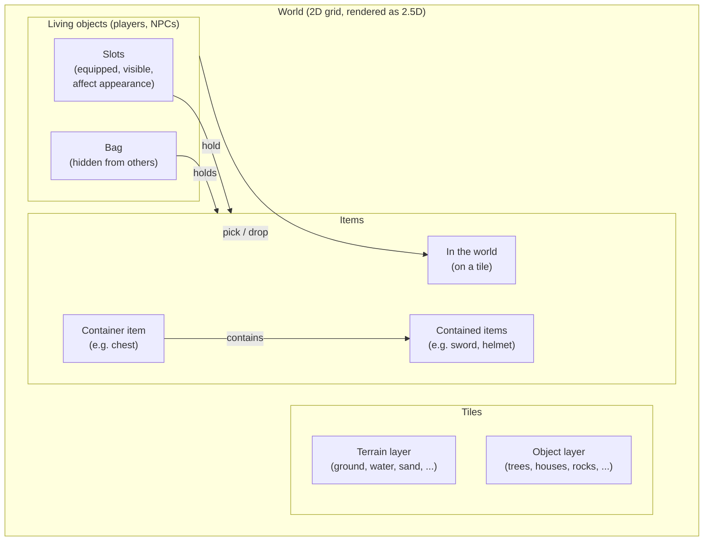
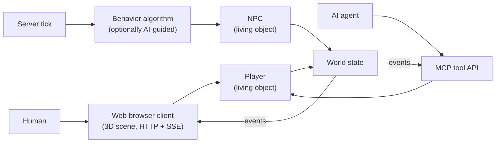
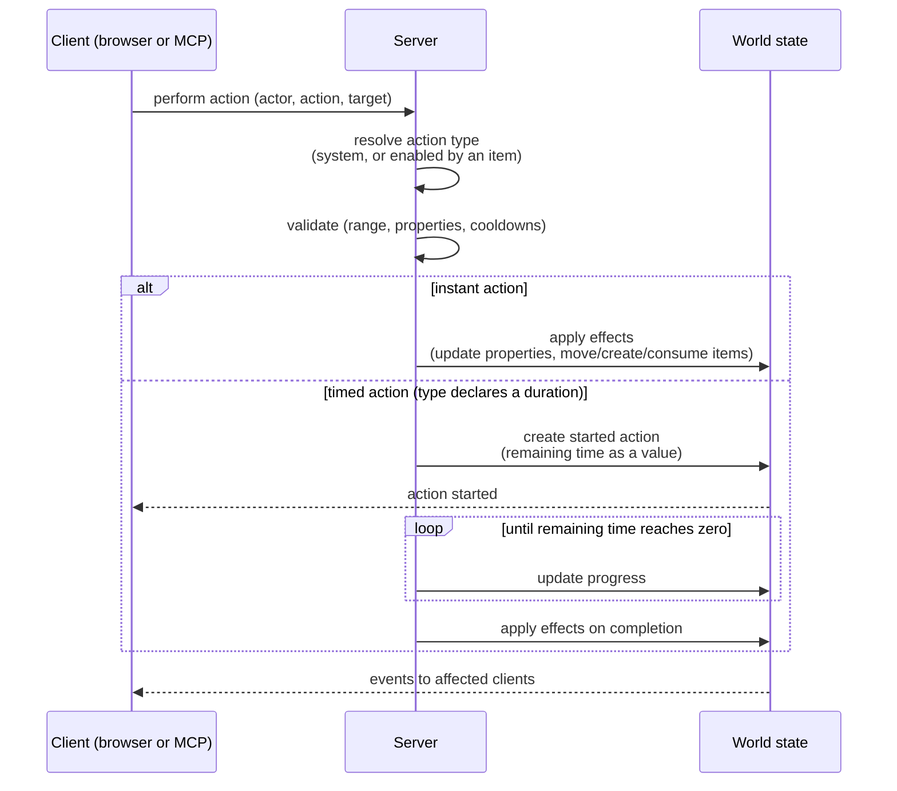
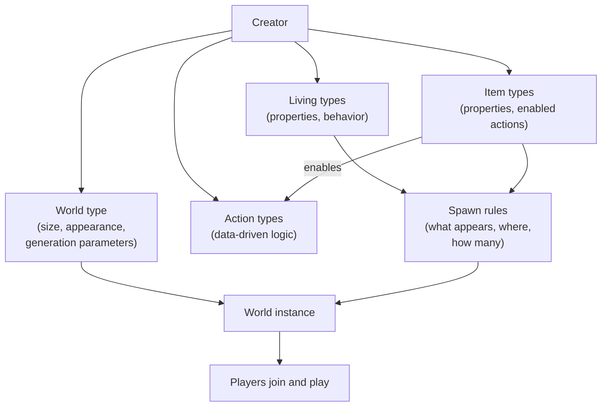
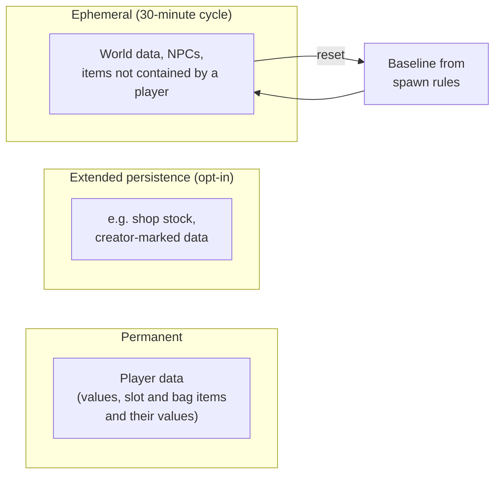

# Virtual World

Virtual World is a multiplayer world platform built as an
[aiwebengine](https://softagen.com) script. Its key idea is a split between
two audiences:

- **Creators** design worlds: they define what a world looks like, what
  lives in it, what items exist, and what those items let you do.
- **Players** play in those worlds: they explore, pick up and use items,
  and interact with each other and with NPCs — without needing to know
  anything about how the world was built.

Everything a creator defines is data, not code: new kinds of beings, items,
and actions are content definitions stored in the database and interpreted
by the engine, so a world can grow without redeploying the script.

## The world

A world is a two-dimensional grid of tiles (currently 100×100), visualized
in the browser as a three-dimensional scene — a 2.5D presentation: game
logic (movement, positions, spawning) operates on the 2D grid, while the
client renders that grid with height, perspective, and 3D models.

Each tile has a terrain type (ground, water, sand, rock, …) and may carry an
object (tree, house, mountain, …). The base map is generated from the
world's type and seed; creators then modify it through **world mods**,
persisted per-tile overrides on the terrain and object layers.

A world contains two kinds of entities:

- **Living objects** — players and NPCs. They occupy a tile, can move, and
  can carry items.
- **Items** — objects that exist on a tile in the world, inside a living
  object, or inside another item. Items can be containers: a chest can hold
  a sword and a helmet, and picking up the chest brings its contents along.

A living object carries items in two places:

- **Slots** — equipped items (held tool, worn helmet, …). Slot contents are
  visible to other parties and can affect the living object's outside
  appearance.
- **Bag** — general storage. Bag contents are hidden from other parties.

Both living objects and items have **property values** (health, durability,
counts, custom properties defined by their type). Properties are what
actions read and modify.

## Who controls what

Players and NPCs are both living objects; they differ only in who steers
them:

- A **player** is controlled by a human through the web browser interface,
  or by an AI client through the MCP tool API — the same world state and
  the same rules apply to both.
- An **NPC** operates itself: a server-side tick advances each NPC using
  its behavior algorithm, optionally with AI guidance for higher-level
  decisions.

## Actions

Actions are how living objects affect the world — other living objects,
items, or tiles. There are two sources of actions:

- **System actions** are built in and always available: move, pick, drop.
- **Item-enabled actions** — everything else. An action type is defined by
  a creator and attached to an item type; holding (or targeting) an item of
  that type is what makes the action available. An axe enables chopping, a
  fishing rod enables fishing, a creator's stone enables world editing.

Creator-defined actions are expressed as data-driven logic (checked and run
by an interpreter, never `eval`), reading and writing the property values
of the actor, the target, and the items involved.

Like living objects and items, actions have **values** of their own. An
action type can declare a **duration** — chopping a tree might take one
minute — and a started action is then a live instance in the world whose
values track progress, such as the time still needed to complete. Effects
apply when the action completes, and an in-progress action can be observed
(and potentially interrupted) like any other part of the world state.

## Creating a world

World building is type-driven. A creator first creates a **world type**:
the world's size, its visual appearance (terrain style, tile set), and
generation parameters. Worlds are then instances of that type.

On top of the world type, the creator defines content types:

- **Living types** — kinds of NPCs (and player appearance variants), with
  their properties and behavior.
- **Item types** — kinds of items, with their properties and the actions
  they enable.
- **Action types** — the data-driven logic described above.

Finally the creator writes **spawn rules**: which NPC types and item types
appear in the world, where, and in what quantity. The engine uses these
rules to populate the world and keep it populated as things are consumed.

## Persistence and the reset cycle

Not everything in a world lives equally long. There are three tiers:

- **Player data is permanent.** A player's property values and everything
  the player contains — slot and bag items, including those items' own
  values and contents — are stored persistently across sessions and world
  resets.
- **World state is ephemeral by default.** NPCs, items lying in the world
  or held by NPCs, and other world data normally clear after 30 minutes,
  and the world resets to the baseline described by its spawn rules. This
  keeps worlds fresh and self-healing: abandoned litter disappears and
  depleted resources respawn.
- **Extended persistence is opt-in.** A creator can mark specific data to
  survive the reset cycle — for example a shop that keeps its sellable
  items in stock far longer than 30 minutes.

In the current implementation, content types are called **classes** in the
code (`living-class-storage.ts`, `item-class-storage.ts`,
`action-class-storage.ts`), world size is fixed at 100×100, world types are
a fixed set of generation presets (forest, island, cave, building), and
in-world editing is gated by the creator's stone item. The direction of
travel — fully creator-defined world types, spawn rules, container items,
slots and bags, timed actions, the persistence tiers above, and a real
permission model — is tracked in [TODO-arch.md](TODO-arch.md).

## Code layout

- `virtual-world.js` — deployed entrypoint; wires modules and registers
  routes, streams, and MCP tools.
- `assets/server/` — real server-side implementation (the sibling `server/`
  directory contains one-line re-export shims so local imports resolve).
- `assets/public/` — browser client: 3D scene, input, state sync over SSE.

See the repository root `CLAUDE.md` for build, typecheck, and deployment
commands.
