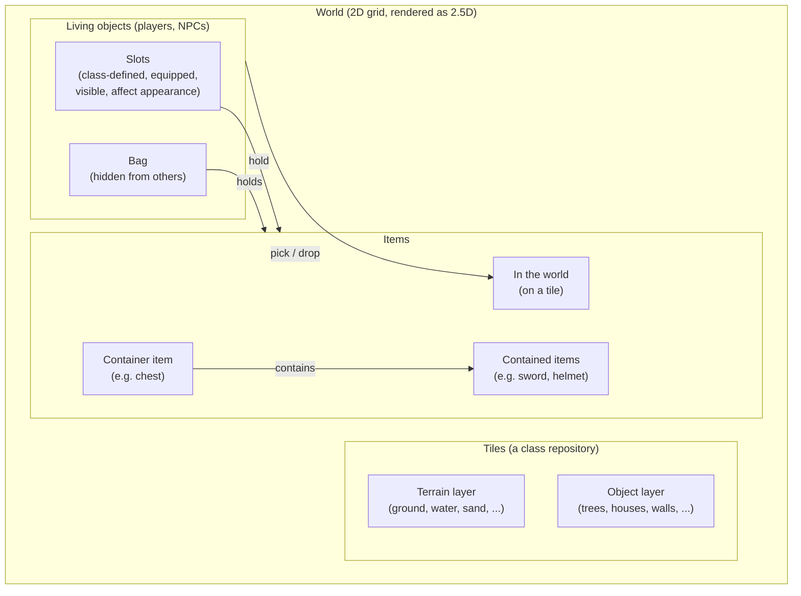
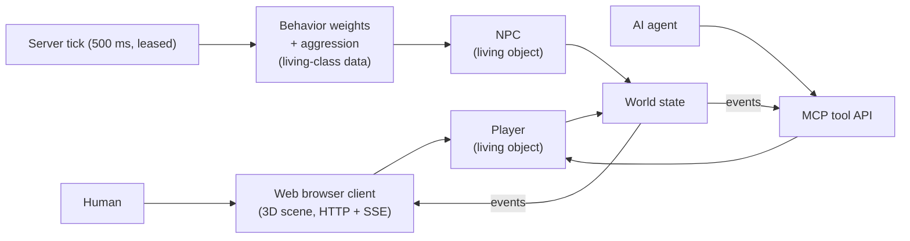
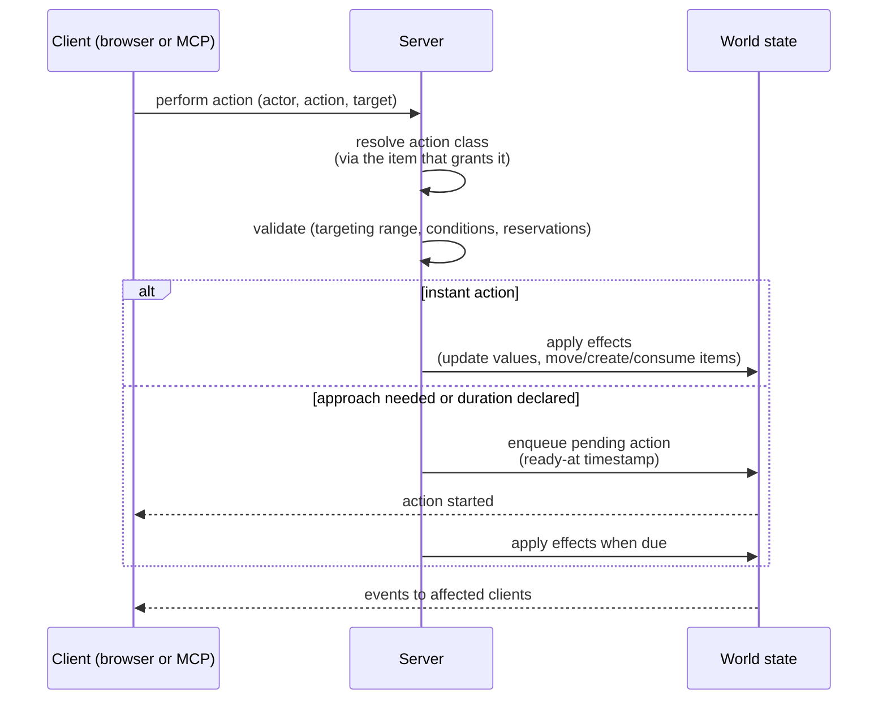
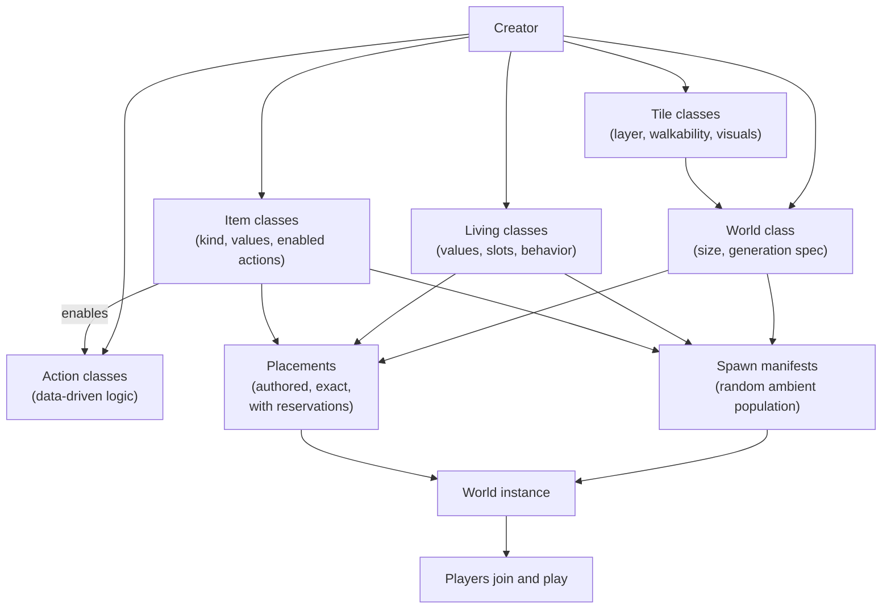
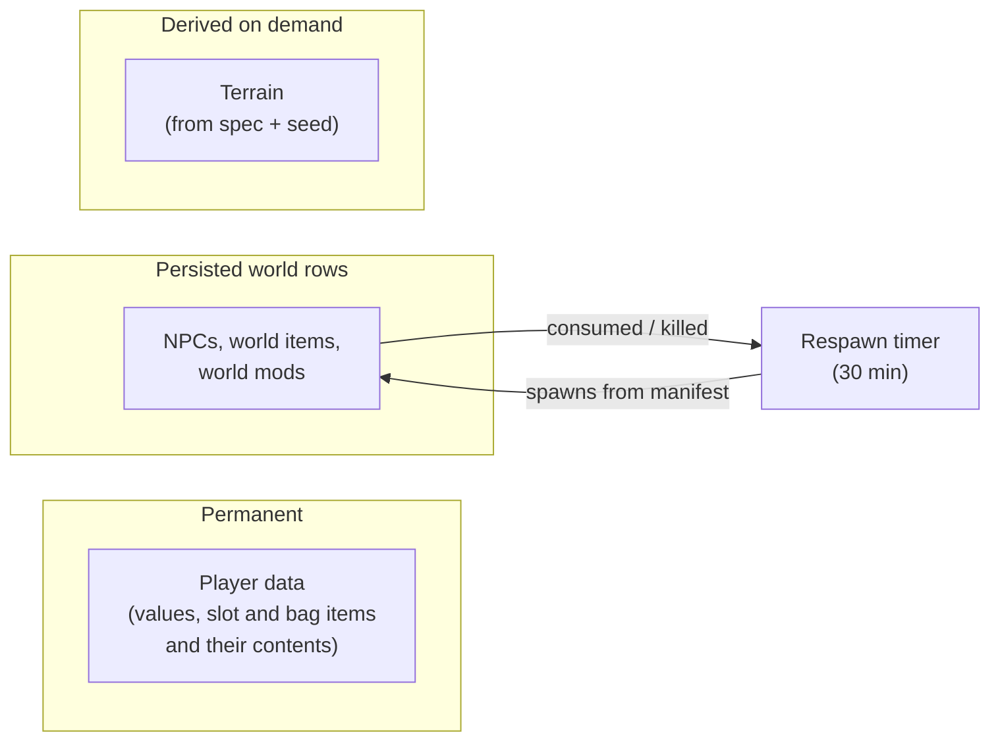

# Virtual World

Virtual World is a multiplayer world platform built as an
[aiwebengine](https://softagen.com) script. Its key idea is a split between
two audiences:

- **Creators** design worlds: they define what a world looks like, what
  lives in it, what items exist, and what those items let you do.
- **Players** play in those worlds: they explore, fight, build, pick up and
  use items, and interact with each other and with NPCs — without needing
  to know anything about how the world was built.

Everything a creator defines is data, not code: tiles, beings, items, and
actions are content definitions stored in the database and interpreted by
the engine, so a world can grow without redeploying the script.

## The world

A world is a two-dimensional grid of tiles (100×100 by default; a world
class can configure its own size from 8×8 up to 200×200), visualized in the
browser as a three-dimensional scene — a 2.5D presentation: game logic
(movement, positions, spawning) operates on the 2D grid, while the client
renders that grid with height, perspective, and 3D models.

Each tile carries a **terrain-layer** tile (ground, water, sand, rock, …)
and may carry an **object-layer** tile (tree, house, wall, …). Tile types
are themselves creator-defined content — a class repository like items and
livings, not a fixed enum — so a world can introduce terrain the engine has
never heard of. A tile class says which layer it belongs to, whether it is
walkable, and how it draws: one of the client's mesh recipes (`floor`,
`water`, `rock`, `mountain`, `fence`) plus colors and a height.

The base map is generated from the world class's **generation spec** and a
seed derived from the world's id; creators then modify it through **world
mods**, persisted per-tile overrides on the terrain and object layers.
Terrain itself is never stored — it is reproducible from the seed, and only
the mods layered on top of it are persisted.

A world contains two kinds of entities:

- **Living objects** — players and NPCs. They occupy a tile, can move, and
  can carry items.
- **Items** — objects that exist on a tile in the world, inside a living
  object, or inside another item. Items can be containers: a chest can hold
  a sword and a helmet, and picking up the chest brings its contents along.

A living object carries items in two places:

- **Slots** — equipped items (held tool, worn helmet, …). Which slots exist
  is living-class data: a biped has hands and legs, a quadruped has four,
  and each slot carries tags (`hand`, `manipulator`, `leg`) that actions can
  reason about. Slot contents are visible to other parties and can affect
  the living object's outside appearance.
- **Bag** — general storage. Bag contents are hidden from other parties.

Both living objects and items have **property values** (hit points, armor
class, level, durability, custom properties defined by their class).
Properties are what actions read and modify, and each carries a visibility
(`public` or `owner`) that decides whether other players see it.

```mermaid
flowchart TB
    subgraph World["World (2D grid, rendered as 2.5D)"]
        subgraph Tile["Tiles (a class repository)"]
            Terrain["Terrain layer<br/>(ground, water, sand, ...)"]
            Object["Object layer<br/>(trees, houses, walls, ...)"]
        end
        subgraph Living["Living objects (players, NPCs)"]
            Slots["Slots<br/>(class-defined, equipped,<br/>visible, affect appearance)"]
            Bag["Bag<br/>(hidden from others)"]
        end
        subgraph Items["Items"]
            WorldItem["In the world<br/>(on a tile)"]
            Container["Container item<br/>(e.g. chest)"]
            Contained["Contained items<br/>(e.g. sword, helmet)"]
        end
    end
    Living -- "pick / drop" --> WorldItem
    Slots -- hold --> Items
    Bag -- holds --> Items
    Container -- contains --> Contained
```

## Who controls what

Players and NPCs are both living objects; they differ only in who steers
them:

- A **player** is controlled by a human through the web browser interface,
  or by an AI client through the MCP tool API — the same world state and
  the same rules apply to both.
- An **NPC** operates itself: a server-side tick (every 500 ms, coordinated
  between runtime instances by a lease) advances each NPC. Its temperament
  is living-class data — the odds it idles, picks something up, drops
  something, or forages with a tool it carries, plus whether it is
  `aggressive` and will start a fight with a player who shares its tile.

```mermaid
flowchart LR
    Human["Human"] --> Browser["Web browser client<br/>(3D scene, HTTP + SSE)"]
    AI["AI agent"] --> MCP["MCP tool API"]
    Browser --> PlayerObj["Player<br/>(living object)"]
    MCP --> PlayerObj
    Tick["Server tick (500 ms, leased)"] --> Algo["Behavior weights<br/>+ aggression<br/>(living-class data)"]
    Algo --> NPCObj["NPC<br/>(living object)"]
    PlayerObj --> WorldState["World state"]
    NPCObj --> WorldState
    WorldState -- "events" --> Browser
    WorldState -- "events" --> MCP
```

## Actions

Actions are how living objects affect the world — other living objects,
items, or tiles. Movement is the one built-in verb, handled by its own
route. **Everything else is item-enabled**: an action class is defined by a
creator and attached to an item class, and carrying (or targeting) an item
of that class is what makes the action available. An axe enables chopping, a
fishing rod enables fishing, a creator's stone enables world editing.

Even the basics work this way. Picking up, examining, poking, following and
fighting are granted by the **wanderer's bundle** (`starter_kit`), a
non-droppable artifact every player is given on first load. There is no
privileged tier of built-in verbs — the bundle is simply the item everyone
has, which is what makes its actions universal.

Creator-defined actions are expressed as data-driven logic (checked and run
by an interpreter, never `eval`), reading and writing the property values of
the actor, the target, and the items involved. The vocabulary is a set of
declarative blocks:

- `livingEffect` — mutate a living's values; single target or an area burst,
  gated by conditions on both actor and target, optionally `lethal`.
- `itemEffect` — the same for an item's state (what `break` and `fix` do).
- `logicSpec` — edit the source item the actor is holding (tuning a kantele).
- `linkedWorld` — build a way into a brand-new world (portals and doors).
- `progression` — spend one living value to raise another (experience → level).
- `worldMutation` — write the map's terrain or object layer.

### Aiming and reach

Each action carries a **targeting** spec, and the client derives its aiming
mode from it:

| Field         | Meaning                                                          |
| ------------- | ---------------------------------------------------------------- |
| `range`       | reach in tiles (nearby targets default to 5)                     |
| `rangeShape`  | `adjacent` (melee), `line` (ranged single), `radius` (area)      |
| `approach`    | `walk_adjacent` — path to the target, then act — or `none`       |
| `areaRadius`  | for `radius`, how far the effect spreads from the chosen point   |
| `rangeFrom`   | whether `range` comes from the action or the granting item       |
| `targetScope` | whether an item target may be in the `world`, `inventory`, `any` |

This gives two flows: **target-first** (click a thing, then act on it) for
manipulation, and **action-first** (arm the action, move a ground reticle,
tap to cast) for area attacks. Range is always re-validated server-side; the
client's preview is advisory.

### Timed actions

Like living objects and items, actions have values of their own. An action
class can declare a **duration** — a started action is then queued in the
pending-action store, the actor gets an immediate toast, and effects apply
when it completes. The same queue backs walk-then-act approaches, follow,
and NPC orchestration.

```mermaid
sequenceDiagram
    participant C as Client (browser or MCP)
    participant S as Server
    participant W as World state
    C->>S: perform action (actor, action, target)
    S->>S: resolve action class<br/>(via the item that grants it)
    S->>S: validate (targeting range, conditions, reservations)
    alt instant action
        S->>W: apply effects<br/>(update values, move/create/consume items)
    else approach needed or duration declared
        S->>W: enqueue pending action<br/>(ready-at timestamp)
        W-->>C: action started
        S->>W: apply effects when due
    end
    W-->>C: events to affected clients
```

## Combat, death and progression

Every living object gets combat values regardless of class:
`maxHitPoints`, `currentHitPoints`, `armorClass`, `weaponClass`.

An attacking effect can roll instead of applying a fixed amount: a d20
against the target's armor class, then 1..(the actor's effective weapon
class) subtracted — so a strike scales with the wielded weapon and can miss.
Sustained fights are a per-world tick; follow and fight both surface in the
HUD's active-actions panel.

Death is living-class data, not engine behavior. A class names its
`deathClassId` (a player becomes a ghost), its `corpseItemId` (an NPC leaves
a corpse item), and its `reviveClassId` (how a ghost comes back).

Players also carry `level`, `experience` and `totalExperience`. Actions
award experience for succeeding; a kill awards the action's experience
scaled by the target's level. Spending it is itself an action —
`advance_level` at a guild training post — whose `progression` block drains
the spendable `experience` (a level costs its own number × 1000) while
leaving the lifetime `totalExperience` tally alone.

## Travel between worlds

Worlds are not islands. A portal or a door is an ordinary item with a linked
destination, and building one is a data verb (`linkedWorld`) rather than a
special case: it creates the destination world and plants a matched pair of
items linking both ends. A portal lets the player choose the destination
shape and sits underfoot at the far end; a door always opens into an
interior and hangs on the wall beside the arrival tile.

Authored links (see placements, below) choose a destination mode:

- `ensure_world_class` — create one interior per (world, placement) the
  first time it is used, then reuse it.
- `existing_world` — point at one specific world by id.
- `source_world` — lead back to whoever linked here. This is what a return
  door uses: a class template cannot name its own callers.

## Creating a world

World building is class-driven. Content lives in five class repositories —
**world**, **tile**, **item**, **living**, and **action** — all editable
from the in-game editor panels or through the `virtualWorld*` MCP tools,
neither of which needs a deploy.

A creator first creates a **world class**: the world's size and its
**generation spec**. Generation is data, not a menu pick: the spec names the
floor, boundary and wall tiles, then lists passes to run in order —
`enclosures`, `wall_segments`, `coast`, `river`, `blobs`, `scatter`. Five
built-in presets (forest, island, cave, village, building) are seed data
reproducing what the original hardcoded world types did; a creator can edit
any of them or write a new spec from scratch. Worlds are instances of a
class, and changing a spec regenerates every world of that class.

On top of the world class, the creator defines content classes:

- **Living classes** — kinds of NPCs (and player appearance variants), with
  their values, slot layout, behavior weights and aggression. Appearance is
  three picks, not artwork: a **visual style** (the avatar silhouette —
  humanoid, wolfish, bearish, doggish, birdlike, equine), a **size** and a
  **color**. Drawing a new silhouette is client work, but every later
  species that reuses one is just a different style/size/color combination:
  the built-in donkey is the horse's equine recipe with a grey coat, and
  cost no new artwork.
- **Item classes** — kinds of items, with their values and the actions they
  enable. A **kind** (`tool`, `artifact`, `placeable`, `consumable`,
  `container`, `world_item`) decides how the item behaves, and the same
  three appearance picks apply: a **visual style** (block, blade, bow,
  chest, door, staff, orb, plant, scroll, book, broadleaf), a size and a
  color. A `broadleaf`-style item is a _fixture_: it draws as its own
  standalone mesh and takes the place of whatever terrain feature the map
  would otherwise put on its tile.
- **Tile classes** — kinds of terrain and object-layer tiles, as described
  above.
- **Action classes** — the data-driven logic described above.

Finally the creator says what appears in the world, through two mechanisms
that answer different questions:

- **Spawn manifests** (`itemSpawns` / `npcSpawns`) — ambient population,
  scattered at random and re-rolled per world. "Five wolves and three saws,
  somewhere."
- **Placements** — authored content at known coordinates, identical in every
  world of the class. A placement has a kind (`item`, `fixture`, `npc`,
  `terrain`, `structure`, `portal`), a class id resolved against the
  matching repository, an exact position, and arbitrary state. "An ancient
  oak at the centre."

A placement may also **reserve** an area — a circle or rectangle — carrying
rules that the rest of the engine asks about: `block_plant`, `block_build`,
`block_terrain_feature` (generation routes rivers around it), `clear_terrain`,
`block_random_spawn`, `spawn_area` (arriving players prefer these tiles),
and `protect_landmark`. A protected clearing around a landmark is one
placement with one reservation, not a conditional in the engine.

Editing a class changes the template; existing worlds are deliberately left
alone until reconciled ("Apply to world"), which creates added placements
and removes the objects its own removed placements created — tracked per
world by placement id, so a player's property is never bulldozed by someone
else's template edit.

[DOC-authoring-worlds.md](DOC-authoring-worlds.md) is the practical guide to
placements, reservations and linked interiors.

```mermaid
flowchart TB
    Creator["Creator"] --> WC["World class<br/>(size, generation spec)"]
    Creator --> TC["Tile classes<br/>(layer, walkability, visuals)"]
    Creator --> LC["Living classes<br/>(values, slots, behavior)"]
    Creator --> IC["Item classes<br/>(kind, values, enabled actions)"]
    Creator --> AC["Action classes<br/>(data-driven logic)"]
    IC -- "enables" --> AC
    TC --> WC
    WC --> Manifests["Spawn manifests<br/>(random ambient population)"]
    WC --> Placements["Placements<br/>(authored, exact,<br/>with reservations)"]
    LC --> Manifests
    IC --> Manifests
    LC --> Placements
    IC --> Placements
    Manifests --> WorldInst["World instance"]
    Placements --> WorldInst
    WorldInst --> Players["Players join and play"]
```

## The social layer

Players have nicknames, and online presence is tracked by heartbeat with a
short TTL, broadcast as presence events. Chat comes in two forms: per-world
chat visible to everyone in the world, and direct messages between two
players, each with its own history endpoint. Everything realtime reaches the
client over SSE, with events carrying a `{scope, seq}` pair so a client that
misses one can resync rather than reload.

## Persistence

Not everything in a world lives equally long.

- **Player data is permanent.** A player's values and everything the player
  contains — slot and bag items, including those items' own state and
  contents — are stored per user and survive sessions and world changes.
- **World state is persisted, and self-heals by respawn.** NPCs, world
  items, and world mods are ordinary DB rows; the world is never wiped. What
  keeps it from being strip-mined is a per-entity respawn timer: when
  something from a spawn manifest is consumed or killed, a timer is written,
  and 30 minutes later that item or NPC is spawned again.
- **Terrain is derived, not stored.** The map is regenerated from the world
  class's spec and the world's seed on demand; only world mods are persisted.

A coarser reset cycle, and opt-in extended persistence for creator-marked
data (a shop that keeps stock far longer than its neighbours), are design
directions rather than current behavior — see [TODO-arch.md](TODO-arch.md).

```mermaid
flowchart LR
    subgraph Permanent["Permanent"]
        PD["Player data<br/>(values, slot and bag items<br/>and their contents)"]
    end
    subgraph Persisted["Persisted world rows"]
        WD["NPCs, world items,<br/>world mods"]
    end
    subgraph Derived["Derived on demand"]
        Terrain["Terrain<br/>(from spec + seed)"]
    end
    WD -- "consumed / killed" --> Timer["Respawn timer<br/>(30 min)"]
    Timer -- "spawns from manifest" --> WD
```

## Permissions

Creating a class of any kind is gated by holding the creator's stone item.
Editing or deleting an existing class requires being its owner, or being an
admin — a row in a DB-only admin table with no route or tool to write it, so
the override authority is granted by an operator rather than from inside the
game. Abuse controls beyond this (rate limits, quotas) are tracked in
[TODO-arch.md](TODO-arch.md).

## Code layout

- `virtual-world.js` — deployed entrypoint; registers routes, streams, and
  MCP tools, and delegates to the server modules by name.
- `assets/server/` — real server-side implementation (the sibling `server/`
  directory contains one-line re-export shims so local imports resolve).
- `assets/public/` — browser client: 3D scene, input, aiming, editors, and
  state sync over SSE.

Companion documents:

- [DOC-authoring-worlds.md](DOC-authoring-worlds.md) — authoring placements,
  reservations and linked interiors without touching code.
- [DESIGN-targeting.md](DESIGN-targeting.md) — the targeting/aiming design.
- [TODO-arch.md](TODO-arch.md) — architectural work remaining, including the
  runtime capabilities it depends on.
- [TODO.md](TODO.md) — the feature backlog: open caveats, deferred
  features, known-unbalanced values.

See the repository root `CLAUDE.md` for build, typecheck, and deployment
commands.
